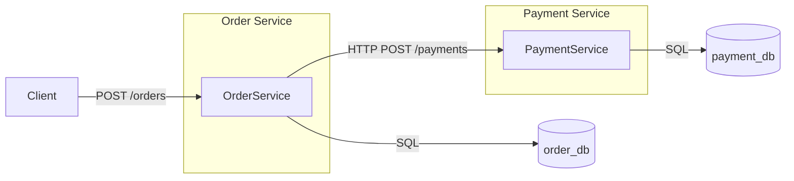

# AP2 Assignment 1 — Clean Architecture Microservices (Order & Payment)

This project implements the assignment requirements from the uploaded PDF: two Go microservices (`order-service` and `payment-service`) using Clean Architecture, REST communication via Gin, separate PostgreSQL databases, manual DI in `main.go`, and a timeout-protected HTTP client in the Order Service. 

## Services
- **Order Service** (`:8080`): create/read/cancel orders.
- **Payment Service** (`:8081`): authorize payments and query payment status.

## Clean Architecture
Each service uses:
- `internal/domain` — entities and domain errors/constants
- `internal/usecase` — business logic and interfaces (ports)
- `internal/repository` — PostgreSQL persistence
- `internal/transport/http` — Gin handlers (thin delivery layer)
- `internal/app` — application wiring helpers
- `cmd/<service>/main.go` — composition root / manual dependency injection

## Main business rules
- Money uses `int64` only.
- Order amount must be `> 0`.
- `Paid` orders cannot be cancelled.
- Payment declines amounts `> 100000`.
- Order Service uses a custom `http.Client` timeout of at most 2 seconds.
- If Payment Service is unavailable, Order Service returns `503` and marks the order as `Failed`.
## System Overview

- Order Service handles order lifecycle
- Payment Service handles payment authorization
- Services communicate via REST
- Each service owns its own database
- No shared database or shared models

---

## Technologies Used

- Go (Golang)
- Gin (HTTP framework)
- PostgreSQL
- REST API
- Clean Architecture

---

## Services

### Order Service

- Runs on port `8080`
- Manages orders
- Calls Payment Service for payment authorization
- Supports idempotent requests using `Idempotency-Key`

### Payment Service

- Runs on port `8081`
- Processes payment requests
- Returns `Authorized` or `Declined`

## Run
```bash
docker compose up --build
```

## Create databases/tables
Tables are auto-created in `main.go` for convenience, and SQL migrations are also included in each service's `migrations/` directory.

## Example requests
### Create order
```bash
curl -X POST http://localhost:8080/orders \
  -H 'Content-Type: application/json' \
  -d '{"customer_id":"cust-1","item_name":"Keyboard","amount":15000}'
```

### Get order
```bash
curl http://localhost:8080/orders/<order-id>
```

### Cancel order
```bash
curl -X PATCH http://localhost:8080/orders/<order-id>/cancel
```

### Get payment by order id
```bash
curl http://localhost:8081/payments/<order-id>
```
## Idempotency (Bonus)

The system supports idempotent order creation using the `Idempotency-Key` header.

- If a request with the same key is repeated:
  - the existing order is returned
  - no duplicate order is created
  - no additional payment request is sent

### Example

```bash
curl -X POST http://localhost:8080/orders \
-H "Content-Type: application/json" \
-H "Idempotency-Key: test123" \
-d '{"customer_id":"1","item_name":"Test","amount":1000}'

```
## Architecture diagram
```text
Client
  |
  v
Order Service (Gin)
  -> HTTP Handlers
  -> Use Cases
  -> Order Repository -> Order DB
  -> Payment Client (REST, timeout 2s) ---> Payment Service (Gin)
                                              -> HTTP Handlers
                                              -> Use Cases
                                              -> Payment Repository -> Payment DB
```



## Failure handling choice
When Payment Service is unavailable or times out, the Order Service updates the order status to `Failed` and returns `503 Service Unavailable`. This is easy to explain during defense because the order creation attempt already started and the downstream payment decision could not be completed deterministically.
